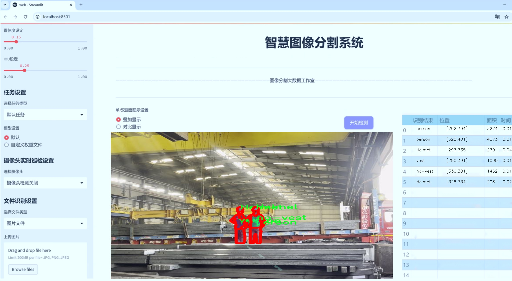
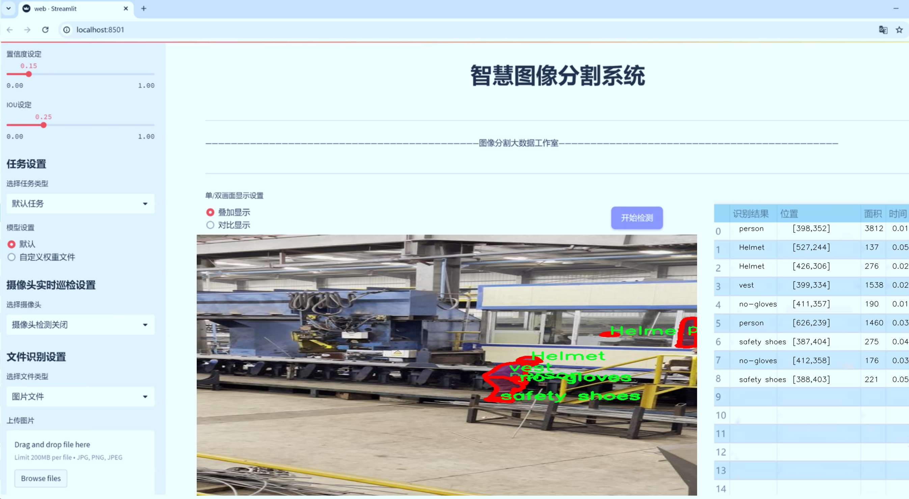
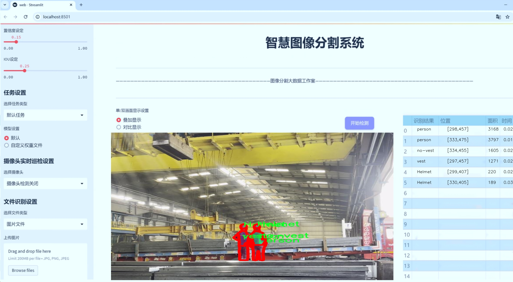
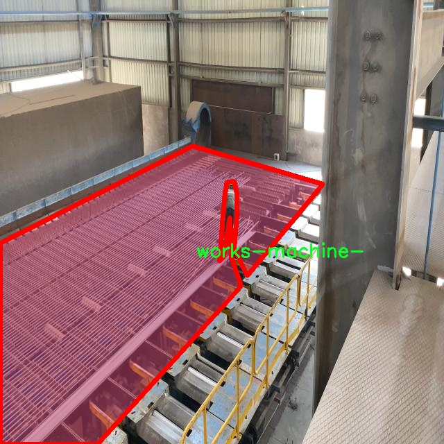
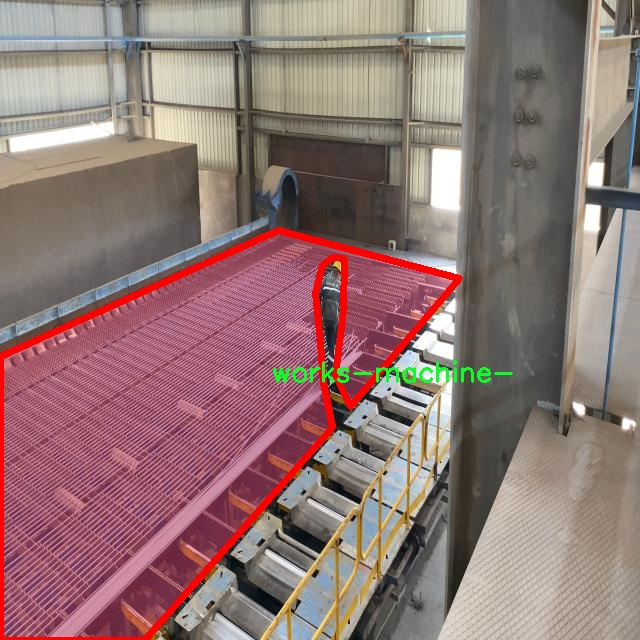
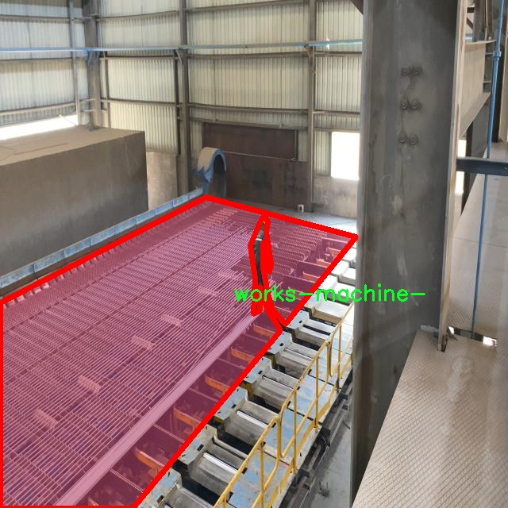
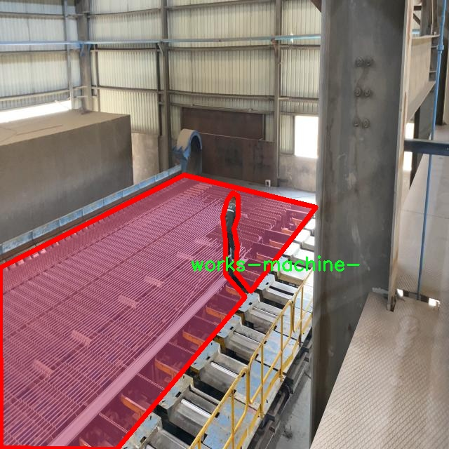
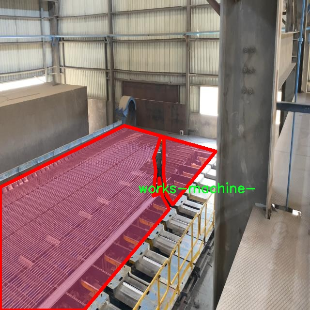

# 工作平台安全作业识别图像分割系统源码＆数据集分享
 [yolov8-seg-swintransformer＆yolov8-seg-goldyolo等50+全套改进创新点发刊_一键训练教程_Web前端展示]

### 1.研究背景与意义

项目参考[ILSVRC ImageNet Large Scale Visual Recognition Challenge](https://gitee.com/YOLOv8_YOLOv11_Segmentation_Studio/projects)

项目来源[AAAI Global Al lnnovation Contest](https://kdocs.cn/l/cszuIiCKVNis)

研究背景与意义

随着工业化进程的加快，工作场所的安全问题日益凸显。尤其是在建筑、制造等高风险行业，工人面临着多种潜在的安全威胁，如机械伤害、跌落、触电等。因此，如何有效识别和监测工作场所的安全作业行为，成为了提升工作安全性的重要课题。近年来，计算机视觉技术的快速发展为这一问题提供了新的解决思路。特别是基于深度学习的图像分割技术，能够对复杂场景中的物体进行精确识别和定位，从而为安全作业的监测与管理提供了有力支持。

在众多图像分割算法中，YOLO（You Only Look Once）系列模型因其高效性和实时性而备受关注。YOLOv8作为该系列的最新版本，结合了更为先进的特征提取和目标检测技术，能够在保证精度的同时显著提高处理速度。然而，尽管YOLOv8在多种场景下表现出色，但在特定应用领域，尤其是针对工作平台的安全作业识别，其性能仍有待提升。因此，基于改进YOLOv8的工作平台安全作业识别图像分割系统的研究具有重要的现实意义。

本研究所采用的数据集包含2800张图像，涵盖了8个类别，包括安全帽、手套、无手套、无背心、人员、安全鞋、背心和工作机械等。这些类别的选择不仅反映了工作场所的基本安全防护装备，还涵盖了与作业相关的关键元素。通过对这些类别的深入分析与标注，研究能够为YOLOv8模型的训练提供丰富的样本数据，从而提高模型在实际应用中的识别准确率。

此外，随着人工智能技术的不断进步，基于深度学习的图像分割系统在安全监测中的应用前景广阔。通过实时监测工作场所的安全作业行为，能够及时发现并纠正不安全的作业状态，减少事故发生的概率。这不仅有助于保护工人的生命安全，还能降低企业的经济损失，提高整体生产效率。因此，构建一个高效、准确的安全作业识别系统，不仅具有学术研究的价值，更具备广泛的社会和经济意义。

综上所述，基于改进YOLOv8的工作平台安全作业识别图像分割系统的研究，旨在通过深度学习技术提升工作场所的安全监测能力，推动智能安全管理的发展。通过对数据集的深入挖掘与模型的优化，期望能够为相关领域提供新的解决方案，促进安全生产的持续改善。此项研究不仅将为学术界提供新的理论依据，也将为实际应用提供切实可行的技术支持，具有重要的应用价值和社会意义。

### 2.图片演示







##### 注意：由于此博客编辑较早，上面“2.图片演示”和“3.视频演示”展示的系统图片或者视频可能为老版本，新版本在老版本的基础上升级如下：（实际效果以升级的新版本为准）

  （1）适配了YOLOV8的“目标检测”模型和“实例分割”模型，通过加载相应的权重（.pt）文件即可自适应加载模型。

  （2）支持“图片识别”、“视频识别”、“摄像头实时识别”三种识别模式。

  （3）支持“图片识别”、“视频识别”、“摄像头实时识别”三种识别结果保存导出，解决手动导出（容易卡顿出现爆内存）存在的问题，识别完自动保存结果并导出到tempDir中。

  （4）支持Web前端系统中的标题、背景图等自定义修改，后面提供修改教程。

  另外本项目提供训练的数据集和训练教程,暂不提供权重文件（best.pt）,需要您按照教程进行训练后实现图片演示和Web前端界面演示的效果。

### 3.视频演示

[3.1 视频演示](https://www.bilibili.com/video/BV1SvmPYHEKc/)

### 4.数据集信息展示

##### 4.1 本项目数据集详细数据（类别数＆类别名）

nc: 8
names: ['Helmet', 'gloves', 'no-gloves', 'no-vest', 'person', 'safety shoes', 'vest', 'works-machine-']


##### 4.2 本项目数据集信息介绍

数据集信息展示

在现代工业环境中，工作场所的安全性至关重要。为了提高安全作业的识别能力，特别是在图像分割领域，开发一个高效的系统是必要的。为此，我们构建了一个名为“bsm”的数据集，旨在为改进YOLOv8-seg的工作平台安全作业识别图像分割系统提供支持。该数据集包含了丰富的标注信息，涵盖了与工作场所安全相关的多个类别，具体包括八个主要类别：头盔（Helmet）、手套（gloves）、无手套（no-gloves）、无背心（no-vest）、人员（person）、安全鞋（safety shoes）、背心（vest）以及工作机械（works-machine-）。这些类别的选择反映了在工作环境中，个人防护装备和工作设备的重要性。

数据集“bsm”通过精心设计的图像采集和标注流程，确保了数据的多样性和准确性。每个类别的图像均来自不同的工作场景，涵盖了建筑工地、制造车间、仓储物流等多种环境。这种多样性不仅提高了模型的泛化能力，还使得系统能够在不同的工作场景中有效识别和分割出相关的安全作业元素。例如，头盔和安全鞋的图像样本展示了在不同光照和角度下的佩戴情况，而手套和无手套的样本则强调了在作业过程中个人防护的必要性。

此外，数据集中的每个类别都经过精确的标注，确保每个对象的边界清晰可辨。这种细致的标注方式对于训练深度学习模型至关重要，因为它直接影响到模型的学习效果和最终的识别精度。通过对“bsm”数据集的训练，YOLOv8-seg能够有效地识别出图像中的各类安全装备及其状态，从而实现对工作场所安全性的实时监控和评估。

在数据集的构建过程中，我们还特别考虑了图像的质量和多样性。为了确保数据集的有效性，采集的图像不仅包括静态图像，还涵盖了动态场景中的人员和设备。这种动态数据的引入，使得模型在处理实际应用时能够更好地适应复杂的工作环境，提升了系统的实用性和可靠性。

通过使用“bsm”数据集，我们期望能够显著提升YOLOv8-seg在工作平台安全作业识别中的表现。随着工业4.0时代的到来，智能化的安全监控系统将成为未来工作的必然趋势，而“bsm”数据集的应用正是这一趋势的重要组成部分。我们相信，通过不断优化和扩展该数据集，未来的安全作业识别系统将能够在更广泛的场景中发挥作用，为工人提供更安全的工作环境，减少事故发生的可能性，最终实现人机和谐共存的目标。











### 5.全套项目环境部署视频教程（零基础手把手教学）

[5.1 环境部署教程链接（零基础手把手教学）](https://www.bilibili.com/video/BV1jG4Ve4E9t/?vd_source=bc9aec86d164b67a7004b996143742dc)


[5.2 安装Python虚拟环境创建和依赖库安装视频教程链接（零基础手把手教学）](https://www.bilibili.com/video/BV1nA4VeYEze/?vd_source=bc9aec86d164b67a7004b996143742dc)

### 6.手把手YOLOV8-seg训练视频教程（零基础小白有手就能学会）

[6.1 手把手YOLOV8-seg训练视频教程（零基础小白有手就能学会）](https://www.bilibili.com/video/BV1cA4VeYETe/?vd_source=bc9aec86d164b67a7004b996143742dc)


按照上面的训练视频教程链接加载项目提供的数据集，运行train.py即可开始训练



     Epoch   gpu_mem       box       obj       cls    labels  img_size
     1/200     0G   0.01576   0.01955  0.007536        22      1280: 100%|██████████| 849/849 [14:42<00:00,  1.04s/it]
               Class     Images     Labels          P          R     mAP@.5 mAP@.5:.95: 100%|██████████| 213/213 [01:14<00:00,  2.87it/s]
                 all       3395      17314      0.994      0.957      0.0957      0.0843

     Epoch   gpu_mem       box       obj       cls    labels  img_size
     2/200     0G   0.01578   0.01923  0.007006        22      1280: 100%|██████████| 849/849 [14:44<00:00,  1.04s/it]
               Class     Images     Labels          P          R     mAP@.5 mAP@.5:.95: 100%|██████████| 213/213 [01:12<00:00,  2.95it/s]
                 all       3395      17314      0.996      0.956      0.0957      0.0845

     Epoch   gpu_mem       box       obj       cls    labels  img_size
     3/200     0G   0.01561    0.0191  0.006895        27      1280: 100%|██████████| 849/849 [10:56<00:00,  1.29it/s]
               Class     Images     Labels          P          R     mAP@.5 mAP@.5:.95: 100%|███████   | 187/213 [00:52<00:00,  4.04it/s]
                 all       3395      17314      0.996      0.957      0.0957      0.0845


### 7.50+种全套YOLOV8-seg创新点代码加载调参视频教程（一键加载写好的改进模型的配置文件）

[7.1 50+种全套YOLOV8-seg创新点代码加载调参视频教程（一键加载写好的改进模型的配置文件）](https://www.bilibili.com/video/BV1Hw4VePEXv/?vd_source=bc9aec86d164b67a7004b996143742dc)

### 8.YOLOV8-seg图像分割算法原理

原始YOLOv8-seg算法原理

YOLOv8-seg是YOLO系列中的最新进展，继承并发展了YOLOv5及其后续版本的设计理念，尤其是在目标检测和图像分割任务中的应用。YOLOv8-seg不仅在检测精度和速度上实现了显著提升，还通过引入新的网络结构和算法优化，增强了模型的灵活性和适应性。该算法的核心原理可以从其网络结构、数据处理方式、特征提取和损失计算等多个方面进行深入探讨。

首先，YOLOv8-seg的网络结构分为四个主要部分：输入端、骨干网络、颈部网络和头部网络。输入端负责图像数据的预处理，包括马赛克数据增强、自适应锚框计算和自适应灰度填充等。马赛克增强技术通过将多张图像随机拼接，生成新的训练样本，促使模型学习到更丰富的特征。这种数据增强方法有效地提高了模型的泛化能力，使其在面对不同场景和物体时表现得更加稳健。

在骨干网络部分，YOLOv8-seg采用了C2f模块，取代了YOLOv5中的C3模块。C2f模块通过并行的梯度流分支设计，增强了特征的提取能力。与传统的卷积层相比，C2f模块能够更有效地捕捉到不同尺度的特征信息，进而提升模型的整体性能。此外，YOLOv8-seg还引入了空间金字塔池化融合（SPPF）结构，以更好地处理多尺度特征，确保模型在处理复杂场景时能够准确识别和分割目标。

颈部网络采用了路径聚合网络（PAN）结构，旨在加强不同尺度特征的融合能力。通过将来自不同层次的特征进行有效整合，YOLOv8-seg能够更好地捕捉到目标的上下文信息，提升目标检测和分割的精度。这一设计理念源于对目标检测任务中不同尺度对象的特征需求的深刻理解，确保了模型在处理各种大小的目标时都能保持高效的性能。

头部网络是YOLOv8-seg的关键部分，它将分类和检测过程进行了有效解耦。通过采用解耦头结构，YOLOv8-seg能够分别处理目标的分类和边界框回归任务，从而提升了模型的训练效率和预测精度。在损失计算方面，YOLOv8-seg使用了Task-Aligned Assigner策略，根据分类与回归的分数加权结果选择正样本。分类分支采用二元交叉熵损失（BCELoss），而回归分支则结合了分布焦点损失（DFLoss）和完全交并比损失函数（CIOULoss），以提高边界框预测的准确性。

YOLOv8-seg的另一个显著创新在于其无锚框检测头的引入。传统的锚框方法在目标检测中存在一定的局限性，尤其是在处理不同尺度和长宽比的目标时，预设的锚框往往难以适应实际情况。YOLOv8-seg通过将目标检测转化为关键点检测，消除了对锚框的依赖，使得模型在训练和推理过程中更加灵活和高效。这一转变不仅简化了模型的结构，还提高了其在多样化数据集上的泛化能力。

在实际应用中，YOLOv8-seg的高效性和准确性使其成为目标检测和图像分割任务的理想选择。例如，在农业领域，YOLOv8-seg被应用于苹果采摘的自动化识别与定位。通过其强大的视觉识别能力，模型能够快速、准确地检测出成熟的苹果，并为自动采摘机器人提供实时的位置信息。此外，结合蚁群算法进行路径规划，进一步提升了自动采摘的效率和精度。

综上所述，YOLOv8-seg通过一系列创新设计和优化策略，极大地提升了目标检测和图像分割的性能。其在网络结构、数据处理、特征提取和损失计算等方面的改进，使得YOLOv8-seg不仅具备了高精度和快速响应的能力，还在多种应用场景中展现出了良好的适应性和实用性。随着YOLOv8-seg的不断发展和应用，其在智能视觉领域的潜力将进一步得到挖掘，为相关行业带来更多的技术突破和应用价值。


### 9.系统功能展示（检测对象为举例，实际内容以本项目数据集为准）

图9.1.系统支持检测结果表格显示

  图9.2.系统支持置信度和IOU阈值手动调节

  图9.3.系统支持自定义加载权重文件best.pt(需要你通过步骤5中训练获得)

  图9.4.系统支持摄像头实时识别

  图9.5.系统支持图片识别

  图9.6.系统支持视频识别

  图9.7.系统支持识别结果文件自动保存

  图9.8.系统支持Excel导出检测结果数据


### 10.50+种全套YOLOV8-seg创新点原理讲解（非科班也可以轻松写刊发刊，V11版本正在科研待更新）

#### 10.1 由于篇幅限制，每个创新点的具体原理讲解就不一一展开，具体见下列网址中的创新点对应子项目的技术原理博客网址【Blog】：


[10.1 50+种全套YOLOV8-seg创新点原理讲解链接](https://gitee.com/qunmasj/good)

#### 10.2 部分改进模块原理讲解(完整的改进原理见上图和技术博客链接)【如果此小节的图加载失败可以通过CSDN或者Github搜索该博客的标题访问原始博客，原始博客图片显示正常】

### YOLOv8简介

按照官方描述，YOLOv8 是一个 SOTA 模型，它建立在以前 YOLO 版本的成功基础上，并引入了新的功能和改进，以进一步提升性能和灵活性。具体创新包括一个新的骨干网络、一个新的 Ancher-Free 检测头和一个新的损失函数，可以在从 CPU 到 GPU 的各种硬件平台上运行。

不过 ultralytics 并没有直接将开源库命名为 YOLOv8，而是直接使用 ultralytics 这个词，原因是 ultralytics 将这个库定位为算法框架，而非某一个特定算法，一个主要特点是可扩展性。其希望这个库不仅仅能够用于 YOLO 系列模型，而是能够支持非 YOLO 模型以及分类分割姿态估计等各类任务。
总而言之，ultralytics 开源库的两个主要优点是：

融合众多当前 SOTA 技术于一体
未来将支持其他 YOLO 系列以及 YOLO 之外的更多算法


下表为官方在 COCO Val 2017 数据集上测试的 mAP、参数量和 FLOPs 结果。可以看出 YOLOv8 相比 YOLOv5 精度提升非常多，但是 N/S/M 模型相应的参数量和 FLOPs 都增加了不少，从上图也可以看出相比 YOLOV5 大部分模型推理速度变慢了。


额外提一句，现在各个 YOLO 系列改进算法都在 COCO 上面有明显性能提升，但是在自定义数据集上面的泛化性还没有得到广泛验证，至今依然听到不少关于 YOLOv5 泛化性能较优异的说法。对各系列 YOLO 泛化性验证也是 MMYOLO 中一个特别关心和重点发力的方向。

### YOLO-MS简介
实时目标检测，以YOLO系列为例，已在工业领域中找到重要应用，特别是在边缘设备（如无人机和机器人）中。与之前的目标检测器不同，实时目标检测器旨在在速度和准确性之间追求最佳平衡。为了实现这一目标，提出了大量的工作：从第一代DarkNet到CSPNet，再到最近的扩展ELAN，随着性能的快速增长，实时目标检测器的架构经历了巨大的变化。

尽管性能令人印象深刻，但在不同尺度上识别对象仍然是实时目标检测器面临的基本挑战。这促使作者设计了一个强大的编码器架构，用于学习具有表现力的多尺度特征表示。具体而言，作者从两个新的角度考虑为实时目标检测编码多尺度特征：

从局部视角出发，作者设计了一个具有简单而有效的分层特征融合策略的MS-Block。受到Res2Net的启发，作者在MS-Block中引入了多个分支来进行特征提取，但不同的是，作者使用了一个带有深度卷积的 Inverted Bottleneck Block块，以实现对大Kernel的高效利用。

从全局视角出发，作者提出随着网络加深逐渐增加卷积的Kernel-Size。作者在浅层使用小Kernel卷积来更高效地处理高分辨率特征。另一方面，在深层中，作者采用大Kernel卷积来捕捉广泛的信息。

基于以上设计原则，作者呈现了作者的实时目标检测器，称为YOLO-MS。为了评估作者的YOLO-MS的性能，作者在MS COCO数据集上进行了全面的实验。还提供了与其他最先进方法的定量比较，以展示作者方法的强大性能。如图1所示，YOLO-MS在计算性能平衡方面优于其他近期的实时目标检测器。


具体而言，YOLO-MS-XS在MS COCO上获得了43%+的AP得分，仅具有450万个可学习参数和8.7亿个FLOPs。YOLO-MS-S和YOLO-MS分别获得了46%+和51%+的AP，可学习参数分别为810万和2220万。此外，作者的工作还可以作为其他YOLO模型的即插即用模块。通常情况下，作者的方法可以将YOLOv8的AP从37%+显著提高到40%+，甚至还可以使用更少的参数和FLOPs。


#### Multi-Scale Building Block Design
CSP Block是一个基于阶段级梯度路径的网络，平衡了梯度组合和计算成本。它是广泛应用于YOLO系列的基本构建块。已经提出了几种变体，包括YOLOv4和YOLOv5中的原始版本，Scaled YOLOv4中的CSPVoVNet，YOLOv7中的ELAN，以及RTMDet中提出的大Kernel单元。作者在图2(a)和图2(b)中分别展示了原始CSP块和ELAN的结构。


上述实时检测器中被忽视的一个关键方面是如何在基本构建块中编码多尺度特征。其中一个强大的设计原则是Res2Net，它聚合了来自不同层次的特征以增强多尺度表示。然而，这一原则并没有充分探索大Kernel卷积的作用，而大Kernel卷积已经在基于CNN的视觉识别任务模型中证明有效。将大Kernel卷积纳入Res2Net的主要障碍在于它们引入的计算开销，因为构建块采用了标准卷积。在作者的方法中，作者提出用 Inverted Bottleneck Block替代标准的3 × 3卷积，以享受大Kernel卷积的好处。

基于前面的分析，作者提出了一个带有分层特征融合策略的全新Block，称为MS-Block，以增强实时目标检测器在提取多尺度特征时的能力，同时保持快速的推理速度。

MS-Block的具体结构如图2(c)所示。假设是输入特征。通过1×1卷积的转换后，X的通道维度增加到n*C。然后，作者将X分割成n个不同的组，表示为，其中。为了降低计算成本，作者选择n为3。

注意，除了之外，每个其他组都经过一个 Inverted Bottleneck Block层，用表示，其中k表示Kernel-Size，以获得。的数学表示如下：


根据这个公式，该博客的作者不将 Inverted Bottleneck Block层连接，使其作为跨阶段连接，并保留来自前面层的信息。最后，作者将所有分割连接在一起，并应用1×1卷积来在所有分割之间进行交互，每个分割都编码不同尺度的特征。当网络加深时，这个1×1卷积也用于调整通道数。

#### Heterogeneous Kernel Selection Protocol
除了构建块的设计外，作者还从宏观角度探讨了卷积的使用。之前的实时目标检测器在不同的编码器阶段采用了同质卷积（即具有相同Kernel-Size的卷积），但作者认为这不是提取多尺度语义信息的最佳选项。

在金字塔结构中，从检测器的浅阶段提取的高分辨率特征通常用于捕捉细粒度语义，将用于检测小目标。相反，来自网络较深阶段的低分辨率特征用于捕捉高级语义，将用于检测大目标。如果作者在所有阶段都采用统一的小Kernel卷积，深阶段的有效感受野（ERF）将受到限制，影响大目标的性能。在每个阶段中引入大Kernel卷积可以帮助解决这个问题。然而，具有大的ERF的大Kernel可以编码更广泛的区域，这增加了在小目标外部包含噪声信息的概率，并且降低了推理速度。

在这项工作中，作者建议在不同阶段中采用异构卷积，以帮助捕获更丰富的多尺度特征。具体来说，在编码器的第一个阶段中，作者采用最小Kernel卷积，而最大Kernel卷积位于最后一个阶段。随后，作者逐步增加中间阶段的Kernel-Size，使其与特征分辨率的增加保持一致。这种策略允许提取细粒度和粗粒度的语义信息，增强了编码器的多尺度特征表示能力。

正如图所示，作者将k的值分别分配给编码器中的浅阶段到深阶段，取值为3、5、7和9。作者将其称为异构Kernel选择（HKS）协议。


作者的HKS协议能够在深层中扩大感受野，而不会对浅层产生任何其他影响。此外，HKS不仅有助于编码更丰富的多尺度特征，还确保了高效的推理。

如表1所示，将大Kernel卷积应用于高分辨率特征会产生较高的计算开销。然而，作者的HKS协议在低分辨率特征上采用大Kernel卷积，从而与仅使用大Kernel卷积相比，大大降低了计算成本。


在实践中，作者经验性地发现，采用HKS协议的YOLO-MS的推理速度几乎与仅使用深度可分离的3 × 3卷积相同。

#### Architecture
如图所示，作者模型的Backbone由4个阶段组成，每个阶段后面跟随1个步长为2的3 × 3卷积进行下采样。在第3个阶段后，作者添加了1个SPP块，与RTMDet中一样。在作者的编码器上，作者使用PAFPN作为Neck来构建特征金字塔[31, 35]。它融合了从Backbone不同阶段提取的多尺度特征。Neck中使用的基本构建块也是作者的MS-Block，在其中使用3 × 3深度可分离卷积进行快速推理。

此外，为了在速度和准确性之间取得更好的平衡，作者将Backbone中多级特征的通道深度减半。作者提供了3个不同尺度的YOLO-MS变体，即YOLO-MS-XS、YOLO-MS-S和YOLO-MS。不同尺度的YOLO-MS的详细配置列在表2中。对于YOLO-MS的其他部分，作者将其保持与RTMDet相同。


### 11.项目核心源码讲解（再也不用担心看不懂代码逻辑）

#### 11.1 ultralytics\models\yolo\pose\predict.py

以下是对给定代码的核心部分进行提炼和详细注释的结果：

```python
# Ultralytics YOLO 🚀, AGPL-3.0 license

from ultralytics.engine.results import Results  # 导入结果处理类
from ultralytics.models.yolo.detect.predict import DetectionPredictor  # 导入检测预测器基类
from ultralytics.utils import DEFAULT_CFG, LOGGER, ops  # 导入默认配置、日志记录器和操作工具

class PosePredictor(DetectionPredictor):
    """
    PosePredictor类，继承自DetectionPredictor类，用于基于姿态模型的预测。
    """

    def __init__(self, cfg=DEFAULT_CFG, overrides=None, _callbacks=None):
        """初始化PosePredictor，设置任务为'pose'并记录使用'mps'作为设备的警告。"""
        super().__init__(cfg, overrides, _callbacks)  # 调用父类构造函数
        self.args.task = 'pose'  # 设置任务类型为姿态预测
        # 检查设备类型，如果是'mps'，则发出警告
        if isinstance(self.args.device, str) and self.args.device.lower() == 'mps':
            LOGGER.warning("WARNING ⚠️ Apple MPS known Pose bug. Recommend 'device=cpu' for Pose models. "
                           'See https://github.com/ultralytics/ultralytics/issues/4031.')

    def postprocess(self, preds, img, orig_imgs):
        """对给定输入图像或图像列表返回检测结果。"""
        # 应用非极大值抑制（NMS）以过滤检测结果
        preds = ops.non_max_suppression(preds,
                                        self.args.conf,  # 置信度阈值
                                        self.args.iou,  # IOU阈值
                                        agnostic=self.args.agnostic_nms,  # 是否类别无关的NMS
                                        max_det=self.args.max_det,  # 最大检测数量
                                        classes=self.args.classes,  # 过滤的类别
                                        nc=len(self.model.names))  # 类别数量

        # 如果输入图像不是列表，则将其转换为numpy数组
        if not isinstance(orig_imgs, list):  
            orig_imgs = ops.convert_torch2numpy_batch(orig_imgs)

        results = []  # 初始化结果列表
        for i, pred in enumerate(preds):  # 遍历每个预测结果
            orig_img = orig_imgs[i]  # 获取原始图像
            # 将预测框的坐标缩放到原始图像的尺寸
            pred[:, :4] = ops.scale_boxes(img.shape[2:], pred[:, :4], orig_img.shape).round()
            # 获取关键点预测
            pred_kpts = pred[:, 6:].view(len(pred), *self.model.kpt_shape) if len(pred) else pred[:, 6:]
            # 缩放关键点坐标到原始图像的尺寸
            pred_kpts = ops.scale_coords(img.shape[2:], pred_kpts, orig_img.shape)
            img_path = self.batch[0][i]  # 获取图像路径
            # 将结果添加到结果列表中
            results.append(
                Results(orig_img, path=img_path, names=self.model.names, boxes=pred[:, :6], keypoints=pred_kpts))
        return results  # 返回所有结果
```

### 代码分析：
1. **PosePredictor类**：该类是一个姿态预测器，继承自YOLO的检测预测器。它专门用于处理姿态估计任务。
2. **初始化方法**：在初始化时，设置任务类型为'pose'，并检查设备类型以避免在特定设备上出现已知的bug。
3. **后处理方法**：该方法负责对模型的输出进行后处理，包括应用非极大值抑制（NMS）以过滤冗余的检测框，并将预测结果缩放到原始图像的尺寸。最终，结果以`Results`对象的形式返回，包含原始图像、路径、类别名称、检测框和关键点信息。

这个文件定义了一个名为 `PosePredictor` 的类，它是从 `DetectionPredictor` 类扩展而来的，主要用于基于姿态模型进行预测。该类的设计目的是为了处理与姿态估计相关的任务。

在类的构造函数 `__init__` 中，首先调用了父类的构造函数，并设置任务类型为 `'pose'`。此外，如果设备类型是 `'mps'`（即苹果的金属性能计算），则会发出警告，提示用户可能会遇到已知的姿态模型问题，建议使用 `'cpu'` 作为设备。

`postprocess` 方法用于处理模型的预测结果。它接收预测结果、输入图像和原始图像作为参数。首先，使用非极大值抑制（NMS）对预测结果进行筛选，以消除冗余的检测框。接着，如果输入的原始图像不是列表格式，则将其转换为 NumPy 数组格式。

然后，方法会遍历每个预测结果，并对每个预测框进行坐标缩放，以适应原始图像的尺寸。预测的关键点也会根据输入图像的尺寸进行缩放。最后，构建一个 `Results` 对象，包含原始图像、图像路径、模型名称、检测框和关键点，并将这些结果存储在一个列表中返回。

整体来看，这个文件的功能是为姿态估计提供一个预测器，能够处理输入图像并返回相应的检测结果，方便后续的分析和应用。

#### 11.2 ultralytics\models\sam\modules\tiny_encoder.py

以下是代码中最核心的部分，并附上详细的中文注释：

```python
import torch
import torch.nn as nn
import torch.nn.functional as F

class Conv2d_BN(torch.nn.Sequential):
    """一个顺序容器，执行2D卷积操作，后接批量归一化。"""

    def __init__(self, in_channels, out_channels, kernel_size=1, stride=1, padding=0, dilation=1, groups=1, bn_weight_init=1):
        """初始化卷积层和批量归一化层。"""
        super().__init__()
        # 添加卷积层
        self.add_module('c', torch.nn.Conv2d(in_channels, out_channels, kernel_size, stride, padding, dilation, groups, bias=False))
        # 添加批量归一化层
        bn = torch.nn.BatchNorm2d(out_channels)
        # 初始化批量归一化层的权重和偏置
        torch.nn.init.constant_(bn.weight, bn_weight_init)
        torch.nn.init.constant_(bn.bias, 0)
        self.add_module('bn', bn)


class PatchEmbed(nn.Module):
    """将图像嵌入为补丁，并将其投影到指定的嵌入维度。"""

    def __init__(self, in_chans, embed_dim, resolution, activation):
        """初始化补丁嵌入层。"""
        super().__init__()
        img_size = (resolution, resolution)  # 假设输入为正方形图像
        self.patches_resolution = (img_size[0] // 4, img_size[1] // 4)  # 计算补丁的分辨率
        self.in_chans = in_chans
        self.embed_dim = embed_dim
        self.seq = nn.Sequential(
            Conv2d_BN(in_chans, embed_dim // 2, kernel_size=3, stride=2, padding=1),
            activation(),
            Conv2d_BN(embed_dim // 2, embed_dim, kernel_size=3, stride=2, padding=1),
        )

    def forward(self, x):
        """通过补丁嵌入层的序列操作处理输入张量。"""
        return self.seq(x)


class TinyViT(nn.Module):
    """
    TinyViT架构，用于视觉任务。
    """

    def __init__(self, img_size=224, in_chans=3, num_classes=1000, embed_dims=[96, 192, 384, 768], depths=[2, 2, 6, 2], num_heads=[3, 6, 12, 24], window_sizes=[7, 7, 14, 7], mlp_ratio=4., drop_rate=0., drop_path_rate=0.1, use_checkpoint=False):
        """
        初始化TinyViT模型。
        """
        super().__init__()
        self.img_size = img_size
        self.num_classes = num_classes
        self.depths = depths
        self.num_layers = len(depths)
        self.mlp_ratio = mlp_ratio

        activation = nn.GELU  # 使用GELU激活函数

        # 初始化补丁嵌入层
        self.patch_embed = PatchEmbed(in_chans=in_chans, embed_dim=embed_dims[0], resolution=img_size, activation=activation)

        # 构建层
        self.layers = nn.ModuleList()
        for i_layer in range(self.num_layers):
            layer = BasicLayer(dim=embed_dims[i_layer], input_resolution=(self.img_size // (2 ** i_layer), self.img_size // (2 ** i_layer)), depth=depths[i_layer], num_heads=num_heads[i_layer], window_size=window_sizes[i_layer], mlp_ratio=self.mlp_ratio, drop=drop_rate)
            self.layers.append(layer)

        # 分类头
        self.head = nn.Linear(embed_dims[-1], num_classes) if num_classes > 0 else nn.Identity()

    def forward(self, x):
        """执行输入张量的前向传播。"""
        x = self.patch_embed(x)  # 通过补丁嵌入层
        for layer in self.layers:
            x = layer(x)  # 通过每一层
        return self.head(x)  # 通过分类头
```

### 代码说明：
1. **Conv2d_BN**: 这个类实现了一个卷积层后接批量归一化的组合，常用于卷积神经网络中以提高训练的稳定性和加速收敛。
  
2. **PatchEmbed**: 该类负责将输入图像分割成多个小补丁，并将这些补丁投影到一个高维空间中，通常用于视觉Transformer模型的输入处理。

3. **TinyViT**: 这是TinyViT模型的主要类，负责初始化模型的各个部分，包括补丁嵌入层和多个基本层（BasicLayer）。它还包含了分类头，用于最终的分类任务。

4. **forward**: 该方法定义了模型的前向传播过程，输入图像通过补丁嵌入层和多个基本层进行处理，最后通过分类头输出结果。

这个程序文件实现了一个名为 TinyViT 的视觉模型架构，主要用于图像分类等视觉任务。该模型是基于轻量级的 Transformer 设计，结合了卷积神经网络的元素，旨在提高计算效率和性能。

首先，文件中导入了一些必要的库，包括 PyTorch 的核心模块和一些工具函数。接着，定义了一系列类，每个类负责模型中的不同组件。

`Conv2d_BN` 类实现了一个简单的卷积层，后接批归一化（Batch Normalization），用于处理输入数据的特征。接下来的 `PatchEmbed` 类负责将输入图像分割成小块（patches），并将这些小块投影到指定的嵌入维度上。

`MBConv` 类实现了移动反向瓶颈卷积层（Mobile Inverted Bottleneck Conv），这是 EfficientNet 架构中的一个重要组成部分。该层通过多个卷积操作和激活函数来提取特征，并在训练时应用随机深度（DropPath）以提高模型的泛化能力。

`PatchMerging` 类用于合并相邻的特征块，并将其投影到新的维度上。`ConvLayer` 类则是一个包含多个 MBConv 层的卷积层，支持下采样和梯度检查点（gradient checkpointing）以节省内存。

`Mlp` 类实现了一个多层感知机（MLP），用于处理 Transformer 架构中的数据。`Attention` 类实现了多头自注意力机制，支持空间感知，并在训练时应用可学习的注意力偏置。

`TinyViTBlock` 类是 TinyViT 模型的基本构建块，结合了自注意力和局部卷积操作。`BasicLayer` 类则是 TinyViT 模型中的一个基本层，包含多个 TinyViTBlock。

`LayerNorm2d` 类实现了二维层归一化，适用于卷积层的输出。最后，`TinyViT` 类是整个模型的核心，负责构建模型的各个层次，包括嵌入层、多个基本层、分类头等。

在 `TinyViT` 的初始化中，模型参数如输入图像大小、输入通道数、类别数、嵌入维度、层深度、注意力头数等都可以自定义。模型的前向传播方法 `forward` 负责将输入数据通过所有层进行处理，最终输出分类结果。

整体来看，这个程序文件展示了如何将卷积神经网络和 Transformer 的优点结合起来，构建一个高效的视觉模型，适用于各种计算机视觉任务。

#### 11.3 ui.py

以下是保留的核心代码部分，并附上详细的中文注释：

```python
import sys
import subprocess

def run_script(script_path):
    """
    使用当前 Python 环境运行指定的脚本。

    Args:
        script_path (str): 要运行的脚本路径

    Returns:
        None
    """
    # 获取当前 Python 解释器的路径
    python_path = sys.executable

    # 构建运行命令，使用 streamlit 运行指定的脚本
    command = f'"{python_path}" -m streamlit run "{script_path}"'

    # 执行命令，并等待其完成
    result = subprocess.run(command, shell=True)
    
    # 检查命令执行的返回码，如果不为0则表示出错
    if result.returncode != 0:
        print("脚本运行出错。")

# 实例化并运行应用
if __name__ == "__main__":
    # 指定要运行的脚本路径
    script_path = "web.py"  # 这里可以直接指定脚本名，假设在当前目录下

    # 调用函数运行脚本
    run_script(script_path)
```

### 代码说明：
1. **导入模块**：
   - `sys`：用于获取当前 Python 解释器的路径。
   - `subprocess`：用于执行外部命令。

2. **定义 `run_script` 函数**：
   - 该函数接受一个参数 `script_path`，表示要运行的 Python 脚本的路径。
   - 使用 `sys.executable` 获取当前 Python 解释器的路径。
   - 构建一个命令字符串，使用 `streamlit` 模块运行指定的脚本。
   - 使用 `subprocess.run` 执行命令，并等待其完成。
   - 检查命令的返回码，如果返回码不为0，表示脚本运行出错，打印错误信息。

3. **主程序块**：
   - 在主程序块中，指定要运行的脚本路径（这里假设脚本名为 `web.py`）。
   - 调用 `run_script` 函数，执行指定的脚本。

这个程序文件名为 `ui.py`，其主要功能是使用当前的 Python 环境来运行一个指定的脚本，具体是通过 Streamlit 框架来启动一个 Web 应用。

程序首先导入了必要的模块，包括 `sys`、`os` 和 `subprocess`，这些模块提供了与系统交互的功能。`sys` 模块用于获取当前 Python 解释器的信息，`subprocess` 模块则用于执行外部命令。

接下来，程序定义了一个名为 `run_script` 的函数，该函数接受一个参数 `script_path`，表示要运行的脚本的路径。在函数内部，首先通过 `sys.executable` 获取当前 Python 解释器的路径。然后，构建一个命令字符串，该命令使用 Streamlit 来运行指定的脚本。命令的格式是 `"{python_path}" -m streamlit run "{script_path}"`，其中 `python_path` 是当前 Python 解释器的路径，`script_path` 是传入的脚本路径。

使用 `subprocess.run` 方法执行构建好的命令。如果命令执行后返回的状态码不为零，表示脚本运行出错，程序会打印出相应的错误信息。

在文件的最后部分，使用 `if __name__ == "__main__":` 来判断是否是直接运行该脚本。如果是，程序会调用 `abs_path` 函数来获取 `web.py` 脚本的绝对路径，并将其传递给 `run_script` 函数，从而启动该脚本。

总体来说，这个程序的主要目的是为用户提供一个简单的接口，通过命令行启动一个 Streamlit Web 应用，方便用户进行开发和测试。

#### 11.4 ultralytics\trackers\utils\kalman_filter.py

以下是经过简化并添加详细中文注释的核心代码部分，主要包含了卡尔曼滤波器的初始化、预测、更新和投影步骤。

```python
import numpy as np
import scipy.linalg

class KalmanFilterXYAH:
    """
    简单的卡尔曼滤波器，用于在图像空间中跟踪边界框。
    状态空间为8维（x, y, a, h, vx, vy, va, vh），
    包含边界框中心位置（x, y）、宽高比a、高度h及其各自的速度。
    """

    def __init__(self):
        """初始化卡尔曼滤波器模型矩阵，设置运动和观测的不确定性权重。"""
        ndim, dt = 4, 1.  # 状态维度和时间步长

        # 创建卡尔曼滤波器模型矩阵
        self._motion_mat = np.eye(2 * ndim, 2 * ndim)  # 运动矩阵
        for i in range(ndim):
            self._motion_mat[i, ndim + i] = dt  # 设置速度部分
        self._update_mat = np.eye(ndim, 2 * ndim)  # 更新矩阵

        # 运动和观测的不确定性权重
        self._std_weight_position = 1. / 20
        self._std_weight_velocity = 1. / 160

    def initiate(self, measurement):
        """
        从未关联的测量值创建跟踪。

        参数
        ----------
        measurement : ndarray
            边界框坐标（x, y, a, h），包含中心位置（x, y）、宽高比a和高度h。

        返回
        -------
        (ndarray, ndarray)
            返回新跟踪的均值向量（8维）和协方差矩阵（8x8维）。
            未观测的速度初始化为0均值。
        """
        mean_pos = measurement  # 取测量值作为均值位置
        mean_vel = np.zeros_like(mean_pos)  # 初始化速度均值为0
        mean = np.r_[mean_pos, mean_vel]  # 合并位置和速度均值

        # 计算协方差矩阵的标准差
        std = [
            2 * self._std_weight_position * measurement[3],  # 高度的标准差
            2 * self._std_weight_position * measurement[3],  # 高度的标准差
            1e-2,  # 宽高比的标准差
            2 * self._std_weight_position * measurement[3],  # 高度的标准差
            10 * self._std_weight_velocity * measurement[3],  # 速度的标准差
            10 * self._std_weight_velocity * measurement[3],  # 速度的标准差
            1e-5,  # 角速度的标准差
            10 * self._std_weight_velocity * measurement[3]   # 速度的标准差
        ]
        covariance = np.diag(np.square(std))  # 生成协方差矩阵
        return mean, covariance

    def predict(self, mean, covariance):
        """
        执行卡尔曼滤波器预测步骤。

        参数
        ----------
        mean : ndarray
            上一时间步的状态均值向量（8维）。
        covariance : ndarray
            上一时间步的状态协方差矩阵（8x8维）。

        返回
        -------
        (ndarray, ndarray)
            返回预测状态的均值向量和协方差矩阵。
        """
        # 计算位置和速度的标准差
        std_pos = [
            self._std_weight_position * mean[3],  # 高度的标准差
            self._std_weight_position * mean[3],  # 高度的标准差
            1e-2,  # 宽高比的标准差
            self._std_weight_position * mean[3]   # 高度的标准差
        ]
        std_vel = [
            self._std_weight_velocity * mean[3],  # 速度的标准差
            self._std_weight_velocity * mean[3],  # 速度的标准差
            1e-5,  # 角速度的标准差
            self._std_weight_velocity * mean[3]   # 速度的标准差
        ]
        motion_cov = np.diag(np.square(np.r_[std_pos, std_vel]))  # 运动协方差矩阵

        # 预测均值和协方差
        mean = np.dot(mean, self._motion_mat.T)  # 更新均值
        covariance = np.linalg.multi_dot((self._motion_mat, covariance, self._motion_mat.T)) + motion_cov  # 更新协方差

        return mean, covariance

    def update(self, mean, covariance, measurement):
        """
        执行卡尔曼滤波器校正步骤。

        参数
        ----------
        mean : ndarray
            预测状态的均值向量（8维）。
        covariance : ndarray
            状态的协方差矩阵（8x8维）。
        measurement : ndarray
            4维测量向量（x, y, a, h），其中（x, y）是中心位置，a是宽高比，h是高度。

        返回
        -------
        (ndarray, ndarray)
            返回测量校正后的状态分布。
        """
        # 先将状态投影到测量空间
        projected_mean, projected_cov = self.project(mean, covariance)

        # 计算卡尔曼增益
        chol_factor, lower = scipy.linalg.cho_factor(projected_cov, lower=True, check_finite=False)
        kalman_gain = scipy.linalg.cho_solve((chol_factor, lower),
                                             np.dot(covariance, self._update_mat.T).T,
                                             check_finite=False).T
        innovation = measurement - projected_mean  # 计算创新

        # 更新均值和协方差
        new_mean = mean + np.dot(innovation, kalman_gain.T)
        new_covariance = covariance - np.linalg.multi_dot((kalman_gain, projected_cov, kalman_gain.T))
        return new_mean, new_covariance

    def project(self, mean, covariance):
        """
        将状态分布投影到测量空间。

        参数
        ----------
        mean : ndarray
            状态的均值向量（8维数组）。
        covariance : ndarray
            状态的协方差矩阵（8x8维）。

        返回
        -------
        (ndarray, ndarray)
            返回给定状态估计的投影均值和协方差矩阵。
        """
        # 计算投影的标准差
        std = [
            self._std_weight_position * mean[3],  # 高度的标准差
            self._std_weight_position * mean[3],  # 高度的标准差
            1e-1,  # 宽高比的标准差
            self._std_weight_position * mean[3]   # 高度的标准差
        ]
        innovation_cov = np.diag(np.square(std))  # 创新协方差矩阵

        mean = np.dot(self._update_mat, mean)  # 更新均值
        covariance = np.linalg.multi_dot((self._update_mat, covariance, self._update_mat.T))  # 更新协方差
        return mean, covariance + innovation_cov  # 返回投影均值和协方差
```

### 代码说明
1. **KalmanFilterXYAH 类**：实现了一个简单的卡尔曼滤波器，用于跟踪边界框，状态空间包括位置、宽高比、高度及其速度。
2. **`__init__` 方法**：初始化模型矩阵和不确定性权重。
3. **`initiate` 方法**：从测量值创建新的跟踪对象，返回均值和协方差。
4. **`predict` 方法**：执行预测步骤，更新状态的均值和协方差。
5. **`update` 方法**：执行校正步骤，使用新的测量值更新状态的均值和协方差。
6. **`project` 方法**：将状态分布投影到测量空间，返回投影后的均值和协方差。

以上代码是卡尔曼滤波器的核心部分，提供了对物体状态的预测和更新机制，适用于跟踪任务。

这个程序文件实现了一个简单的卡尔曼滤波器，用于在图像空间中跟踪边界框。它定义了两个类：`KalmanFilterXYAH`和`KalmanFilterXYWH`，分别用于处理不同格式的边界框信息。

`KalmanFilterXYAH`类的状态空间是8维的，包括边界框中心位置（x, y）、长宽比（a）、高度（h）及其各自的速度（vx, vy, va, vh）。该类使用常速模型来描述物体运动，边界框的位置被视为状态空间的直接观测。

在初始化时，卡尔曼滤波器的模型矩阵被设置，包括运动矩阵和更新矩阵，同时定义了运动和观测的不确定性权重。`initiate`方法用于从未关联的测量创建跟踪，返回新的跟踪的均值向量和协方差矩阵。`predict`方法执行卡尔曼滤波的预测步骤，更新状态的均值和协方差。`project`方法将状态分布投影到测量空间，以便进行更新。

`update`方法执行卡尔曼滤波的校正步骤，通过将测量值与预测值进行比较，更新状态的均值和协方差。`gating_distance`方法计算状态分布与测量之间的门控距离，以便判断测量是否与当前状态相关。

`KalmanFilterXYWH`类继承自`KalmanFilterXYAH`，用于处理边界框的宽度（w）和高度（h），其余功能与父类相似。它重写了`initiate`、`predict`和`update`方法，以适应新的状态表示。

整体来看，这个文件提供了一个高效的卡尔曼滤波器实现，适用于目标跟踪任务，能够处理不同的边界框表示形式，并在跟踪过程中进行状态预测和更新。

#### 11.5 ultralytics\models\sam\modules\encoders.py

以下是经过简化和注释的核心代码部分，主要包括 `ImageEncoderViT` 和 `PatchEmbed` 类，以及相关的前向传播方法。注释详细解释了每个部分的功能和作用。

```python
import torch
import torch.nn as nn
from typing import Optional, Tuple

class PatchEmbed(nn.Module):
    """将图像分割为补丁并进行嵌入的模块。"""

    def __init__(self, kernel_size: Tuple[int, int] = (16, 16), stride: Tuple[int, int] = (16, 16), 
                 in_chans: int = 3, embed_dim: int = 768) -> None:
        """
        初始化 PatchEmbed 模块。

        Args:
            kernel_size (Tuple): 卷积核的大小。
            stride (Tuple): 卷积的步幅。
            in_chans (int): 输入图像的通道数。
            embed_dim (int): 每个补丁的嵌入维度。
        """
        super().__init__()
        # 使用卷积层将图像补丁映射到嵌入空间
        self.proj = nn.Conv2d(in_chans, embed_dim, kernel_size=kernel_size, stride=stride)

    def forward(self, x: torch.Tensor) -> torch.Tensor:
        """计算补丁嵌入，通过卷积层处理输入图像并调整维度。"""
        return self.proj(x).permute(0, 2, 3, 1)  # 将输出从 [B, C, H, W] 转换为 [B, H, W, C]


class ImageEncoderViT(nn.Module):
    """
    使用视觉变换器（ViT）架构对图像进行编码的模块。
    将图像分割为补丁，并通过一系列变换块处理这些补丁。
    """

    def __init__(self, img_size: int = 1024, patch_size: int = 16, in_chans: int = 3, 
                 embed_dim: int = 768, depth: int = 12, out_chans: int = 256) -> None:
        """
        初始化 ImageEncoderViT 模块。

        Args:
            img_size (int): 输入图像的大小（假设为正方形）。
            patch_size (int): 每个补丁的大小。
            in_chans (int): 输入图像的通道数。
            embed_dim (int): 补丁嵌入的维度。
            depth (int): ViT 的深度（变换块的数量）。
            out_chans (int): 输出通道数。
        """
        super().__init__()
        self.img_size = img_size

        # 初始化补丁嵌入模块
        self.patch_embed = PatchEmbed(
            kernel_size=(patch_size, patch_size),
            stride=(patch_size, patch_size),
            in_chans=in_chans,
            embed_dim=embed_dim,
        )

        # 初始化变换块
        self.blocks = nn.ModuleList()
        for _ in range(depth):
            block = Block(dim=embed_dim)  # 假设 Block 类已定义
            self.blocks.append(block)

        # 颈部模块，用于进一步处理输出
        self.neck = nn.Sequential(
            nn.Conv2d(embed_dim, out_chans, kernel_size=1, bias=False),
            nn.LayerNorm(out_chans),
            nn.Conv2d(out_chans, out_chans, kernel_size=3, padding=1, bias=False),
            nn.LayerNorm(out_chans),
        )

    def forward(self, x: torch.Tensor) -> torch.Tensor:
        """处理输入图像，通过补丁嵌入、变换块和颈部模块生成最终编码表示。"""
        # 将输入图像分割为补丁并嵌入
        x = self.patch_embed(x)
        # 通过每个变换块处理嵌入
        for blk in self.blocks:
            x = blk(x)
        # 通过颈部模块生成最终输出
        return self.neck(x.permute(0, 3, 1, 2))  # 调整维度以适应 Conv2d 输入
```

### 代码说明
1. **PatchEmbed 类**:
   - 该类负责将输入图像分割为小的补丁，并通过卷积层将这些补丁映射到一个高维嵌入空间。`forward` 方法返回调整维度后的嵌入结果。

2. **ImageEncoderViT 类**:
   - 该类实现了一个视觉变换器（ViT）编码器，主要用于处理图像数据。它包含以下步骤：
     - 使用 `PatchEmbed` 将输入图像分割为补丁并进行嵌入。
     - 通过多个变换块（`Block` 类）处理嵌入。
     - 最后通过一个颈部模块进一步处理输出，以生成最终的编码表示。

3. **forward 方法**:
   - 该方法定义了前向传播过程，处理输入图像并返回编码后的结果。

这个程序文件定义了一个图像编码器，使用了视觉变换器（Vision Transformer, ViT）架构来将图像编码为紧凑的潜在空间。编码器首先将输入图像分割成多个小块（patches），然后通过一系列的变换块（transformer blocks）处理这些小块，最后通过一个“颈部”模块（neck）生成最终的编码表示。

在类`ImageEncoderViT`中，构造函数初始化了一些重要的参数，包括输入图像的大小、每个小块的大小、输入通道数、嵌入维度、变换块的深度、注意力头的数量等。构造函数中还定义了一个`PatchEmbed`模块，用于将图像的小块嵌入到高维空间中。此外，还可以选择使用绝对位置嵌入和相对位置嵌入。接下来，构造函数创建了多个变换块，并将它们存储在一个模块列表中。最后，定义了一个颈部模块，用于进一步处理输出。

在`forward`方法中，输入图像首先通过小块嵌入模块进行处理，然后如果存在位置嵌入，则将其添加到嵌入结果中。接着，嵌入结果依次通过所有的变换块进行处理，最后通过颈部模块生成最终的编码结果。

接下来的`PromptEncoder`类用于编码不同类型的提示，包括点、框和掩码，以便输入到SAM的掩码解码器中。该编码器生成稀疏和密集的嵌入。构造函数中定义了嵌入维度、输入图像大小、图像嵌入大小、掩码输入通道数等参数，并初始化了一些嵌入模块和网络结构。

`PromptEncoder`的`forward`方法根据输入的点、框和掩码生成稀疏和密集的嵌入。它首先确定输出的批次大小，然后根据输入的提示类型分别调用不同的嵌入方法，最后返回生成的稀疏和密集嵌入。

`PositionEmbeddingRandom`类用于生成随机空间频率的位置信息。它的构造函数初始化了一个高斯矩阵，用于生成位置编码。`_pe_encoding`方法将输入坐标进行编码，`forward`方法生成指定大小的网格的位置信息。

`Block`类实现了变换块，支持窗口注意力和残差传播。它的构造函数中定义了归一化层、注意力模块和多层感知机（MLP）模块。`forward`方法执行前向传播，包括归一化、注意力计算和MLP处理。

`Attention`类实现了多头注意力机制，支持相对位置嵌入。它的构造函数中定义了输入通道数、注意力头数、偏置等参数。`forward`方法计算注意力权重并生成输出。

`window_partition`和`window_unpartition`函数用于将输入张量分割成不重叠的窗口并在需要时进行填充，以及将窗口重新组合回原始形状。

最后，`PatchEmbed`类将图像转换为小块嵌入。它的构造函数定义了卷积层的参数，`forward`方法通过卷积操作计算小块嵌入并调整输出张量的维度。

整个程序文件实现了一个完整的图像编码和提示编码系统，利用视觉变换器架构处理图像数据，适用于计算机视觉任务。

#### 11.6 train.py

以下是代码中最核心的部分，并附上详细的中文注释：

```python
import os
import torch
import yaml
from ultralytics import YOLO  # 导入YOLO模型库

if __name__ == '__main__':  # 确保该模块被直接运行时才执行以下代码
    # 设置训练参数
    workers = 1  # 数据加载的工作进程数
    batch = 8  # 每个批次的样本数量
    device = "0" if torch.cuda.is_available() else "cpu"  # 判断是否使用GPU

    # 获取数据集配置文件的绝对路径
    data_path = abs_path(f'datasets/data/data.yaml', path_type='current')

    # 将路径格式转换为Unix风格
    unix_style_path = data_path.replace(os.sep, '/')
    # 获取数据集所在目录的路径
    directory_path = os.path.dirname(unix_style_path)

    # 读取YAML格式的数据集配置文件
    with open(data_path, 'r') as file:
        data = yaml.load(file, Loader=yaml.FullLoader)

    # 检查并修改数据集路径
    if 'train' in data and 'val' in data and 'test' in data:
        data['train'] = directory_path + '/train'  # 更新训练集路径
        data['val'] = directory_path + '/val'      # 更新验证集路径
        data['test'] = directory_path + '/test'    # 更新测试集路径

        # 将修改后的数据写回YAML文件
        with open(data_path, 'w') as file:
            yaml.safe_dump(data, file, sort_keys=False)

    # 加载YOLO模型配置文件和预训练权重
    model = YOLO(r"C:\codeseg\codenew\50+种YOLOv8算法改进源码大全和调试加载训练教程（非必要）\改进YOLOv8模型配置文件\yolov8-seg-C2f-Faster.yaml").load("./weights/yolov8s-seg.pt")

    # 开始训练模型
    results = model.train(
        data=data_path,  # 指定训练数据的配置文件路径
        device=device,  # 使用指定的设备进行训练
        workers=workers,  # 使用的工作进程数
        imgsz=640,  # 输入图像的大小
        epochs=100,  # 训练的轮数
        batch=batch,  # 每个批次的样本数量
    )
```

### 代码注释说明：
1. **导入必要的库**：导入操作系统相关库、PyTorch库、YAML处理库和YOLO模型库。
2. **主程序入口**：使用`if __name__ == '__main__':`确保只有在直接运行该脚本时才执行后续代码。
3. **设置训练参数**：定义数据加载的工作进程数、批次大小和设备（GPU或CPU）。
4. **获取数据集配置文件路径**：使用`abs_path`函数获取数据集的YAML配置文件的绝对路径。
5. **读取YAML文件**：打开并读取YAML文件内容，保持原有顺序。
6. **修改数据集路径**：检查YAML文件中是否包含训练、验证和测试集路径，并根据实际目录更新这些路径。
7. **写回YAML文件**：将修改后的数据重新写入YAML文件。
8. **加载YOLO模型**：使用指定的配置文件和预训练权重加载YOLO模型。
9. **训练模型**：调用`model.train`方法开始训练，传入数据路径、设备、工作进程数、图像大小、训练轮数和批次大小等参数。

该程序文件`train.py`主要用于训练YOLO（You Only Look Once）模型，具体是YOLOv8的一个变种。程序首先导入了一些必要的库，包括操作系统库`os`、深度学习框架`torch`、YAML文件处理库`yaml`以及YOLO模型库`ultralytics`。此外，还导入了`matplotlib`库并设置其使用的后端为'TkAgg'，这通常用于图形界面的绘图。

在程序的主入口部分，首先设置了一些训练参数，包括工作进程数`workers`、批次大小`batch`、以及设备类型`device`。设备类型会根据是否有可用的GPU进行选择，如果有GPU则使用GPU（标记为"0"），否则使用CPU。

接下来，程序通过`abs_path`函数获取数据集配置文件`data.yaml`的绝对路径，并将其转换为Unix风格的路径。然后，程序提取出该路径的目录部分，以便后续修改数据集路径。

程序打开`data.yaml`文件并读取其内容，使用`yaml.load`函数保持原有的顺序。接着，程序检查YAML文件中是否包含'train'、'val'和'test'三个键，如果存在，则将这些键对应的路径修改为相对于当前目录的路径，并将修改后的内容写回到YAML文件中。

随后，程序加载YOLO模型的配置文件，并指定一个预训练的权重文件进行模型的初始化。这里提供了一个示例路径，但用户可以根据需要替换为其他模型配置文件。

最后，程序调用`model.train`方法开始训练模型，传入训练数据的配置文件路径、设备类型、工作进程数、输入图像大小、训练的epoch数量以及批次大小等参数。这一部分代码负责实际的模型训练过程。

总的来说，该程序文件实现了YOLOv8模型的训练流程，包括数据集路径的配置、模型的加载和训练参数的设置。

### 12.系统整体结构（节选）

### 整体功能和构架概括

该项目的整体功能是实现一个计算机视觉系统，主要用于目标检测和姿态估计。项目使用了YOLO（You Only Look Once）系列模型和其他深度学习技术，提供了训练、预测和跟踪的功能。系统的架构包括多个模块，各自负责不同的任务，如模型的定义、训练过程、预测结果的处理、卡尔曼滤波器的实现等。

- **模型模块**：定义了不同的模型架构，如YOLO和TinyViT，用于特定的视觉任务。
- **训练模块**：提供了训练模型的功能，配置数据集和训练参数。
- **预测模块**：实现了对输入图像进行推理和姿态估计的功能。
- **跟踪模块**：使用卡尔曼滤波器对目标进行跟踪。
- **实用工具模块**：包括各种实用函数和错误处理机制，支持整个系统的运行。

### 文件功能整理表

| 文件路径                                          | 功能描述                                                                                     |
|--------------------------------------------------|----------------------------------------------------------------------------------------------|
| `ultralytics/models/yolo/pose/predict.py`       | 实现姿态估计的预测器，处理输入图像并返回检测结果。                                           |
| `ultralytics/models/sam/modules/tiny_encoder.py`| 定义TinyViT模型架构，处理图像分类和特征提取。                                               |
| `ui.py`                                         | 提供一个命令行接口，通过Streamlit启动Web应用，方便用户进行模型测试和可视化。                  |
| `ultralytics/trackers/utils/kalman_filter.py`  | 实现卡尔曼滤波器，用于在图像空间中跟踪目标的边界框。                                         |
| `ultralytics/models/sam/modules/encoders.py`   | 定义图像编码器和提示编码器，使用视觉变换器架构处理图像数据。                                   |
| `train.py`                                      | 负责训练YOLO模型，配置数据集路径和训练参数，启动模型训练过程。                               |
| `ultralytics/models/rtdetr/model.py`            | 定义RT-DETR模型的结构和前向传播方法，用于目标检测任务。                                       |
| `ultralytics/nn/backbone/revcol.py`            | 实现反向卷积层（RevCol），用于特征提取和网络的主干部分。                                      |
| `ultralytics/nn/extra_modules/ops_dcnv3/test.py`| 测试DCNv3模块的功能，验证其在特定输入上的表现。                                             |
| `ultralytics/engine/validator.py`               | 实现模型验证功能，评估模型在验证集上的性能，提供评估指标。                                   |
| `ultralytics/utils/errors.py`                   | 定义错误处理和异常类，提供统一的错误管理机制。                                               |
| `utils.py`                                      | 提供各种实用工具函数，支持项目中的其他模块。                                                 |
| `ultralytics/utils/metrics.py`                  | 实现各种评估指标的计算，支持模型性能的评估和比较。                                           |

这个表格总结了项目中各个文件的主要功能，帮助理解整个系统的结构和各个模块之间的关系。

注意：由于此博客编辑较早，上面“11.项目核心源码讲解（再也不用担心看不懂代码逻辑）”中部分代码可能会优化升级，仅供参考学习，完整“训练源码”、“Web前端界面”和“50+种创新点源码”以“14.完整训练+Web前端界面+50+种创新点源码、数据集获取”的内容为准。

### 13.图片、视频、摄像头图像分割Demo(去除WebUI)代码

在这个博客小节中，我们将讨论如何在不使用WebUI的情况下，实现图像分割模型的使用。本项目代码已经优化整合，方便用户将分割功能嵌入自己的项目中。
核心功能包括图片、视频、摄像头图像的分割，ROI区域的轮廓提取、类别分类、周长计算、面积计算、圆度计算以及颜色提取等。
这些功能提供了良好的二次开发基础。

### 核心代码解读

以下是主要代码片段，我们会为每一块代码进行详细的批注解释：

```python
import random
import cv2
import numpy as np
from PIL import ImageFont, ImageDraw, Image
from hashlib import md5
from model import Web_Detector
from chinese_name_list import Label_list

# 根据名称生成颜色
def generate_color_based_on_name(name):
    ......

# 计算多边形面积
def calculate_polygon_area(points):
    return cv2.contourArea(points.astype(np.float32))

...
# 绘制中文标签
def draw_with_chinese(image, text, position, font_size=20, color=(255, 0, 0)):
    image_pil = Image.fromarray(cv2.cvtColor(image, cv2.COLOR_BGR2RGB))
    draw = ImageDraw.Draw(image_pil)
    font = ImageFont.truetype("simsun.ttc", font_size, encoding="unic")
    draw.text(position, text, font=font, fill=color)
    return cv2.cvtColor(np.array(image_pil), cv2.COLOR_RGB2BGR)

# 动态调整参数
def adjust_parameter(image_size, base_size=1000):
    max_size = max(image_size)
    return max_size / base_size

# 绘制检测结果
def draw_detections(image, info, alpha=0.2):
    name, bbox, conf, cls_id, mask = info['class_name'], info['bbox'], info['score'], info['class_id'], info['mask']
    adjust_param = adjust_parameter(image.shape[:2])
    spacing = int(20 * adjust_param)

    if mask is None:
        x1, y1, x2, y2 = bbox
        aim_frame_area = (x2 - x1) * (y2 - y1)
        cv2.rectangle(image, (x1, y1), (x2, y2), color=(0, 0, 255), thickness=int(3 * adjust_param))
        image = draw_with_chinese(image, name, (x1, y1 - int(30 * adjust_param)), font_size=int(35 * adjust_param))
        y_offset = int(50 * adjust_param)  # 类别名称上方绘制，其下方留出空间
    else:
        mask_points = np.concatenate(mask)
        aim_frame_area = calculate_polygon_area(mask_points)
        mask_color = generate_color_based_on_name(name)
        try:
            overlay = image.copy()
            cv2.fillPoly(overlay, [mask_points.astype(np.int32)], mask_color)
            image = cv2.addWeighted(overlay, 0.3, image, 0.7, 0)
            cv2.drawContours(image, [mask_points.astype(np.int32)], -1, (0, 0, 255), thickness=int(8 * adjust_param))

            # 计算面积、周长、圆度
            area = cv2.contourArea(mask_points.astype(np.int32))
            perimeter = cv2.arcLength(mask_points.astype(np.int32), True)
            ......

            # 计算色彩
            mask = np.zeros(image.shape[:2], dtype=np.uint8)
            cv2.drawContours(mask, [mask_points.astype(np.int32)], -1, 255, -1)
            color_points = cv2.findNonZero(mask)
            ......

            # 绘制类别名称
            x, y = np.min(mask_points, axis=0).astype(int)
            image = draw_with_chinese(image, name, (x, y - int(30 * adjust_param)), font_size=int(35 * adjust_param))
            y_offset = int(50 * adjust_param)

            # 绘制面积、周长、圆度和色彩值
            metrics = [("Area", area), ("Perimeter", perimeter), ("Circularity", circularity), ("Color", color_str)]
            for idx, (metric_name, metric_value) in enumerate(metrics):
                ......

    return image, aim_frame_area

# 处理每帧图像
def process_frame(model, image):
    pre_img = model.preprocess(image)
    pred = model.predict(pre_img)
    det = pred[0] if det is not None and len(det)
    if det:
        det_info = model.postprocess(pred)
        for info in det_info:
            image, _ = draw_detections(image, info)
    return image

if __name__ == "__main__":
    cls_name = Label_list
    model = Web_Detector()
    model.load_model("./weights/yolov8s-seg.pt")

    # 摄像头实时处理
    cap = cv2.VideoCapture(0)
    while cap.isOpened():
        ret, frame = cap.read()
        if not ret:
            break
        ......

    # 图片处理
    image_path = './icon/OIP.jpg'
    image = cv2.imread(image_path)
    if image is not None:
        processed_image = process_frame(model, image)
        ......

    # 视频处理
    video_path = ''  # 输入视频的路径
    cap = cv2.VideoCapture(video_path)
    while cap.isOpened():
        ret, frame = cap.read()
        ......
```


### 14.完整训练+Web前端界面+50+种创新点源码、数据集获取


# [下载链接：https://mbd.pub/o/bread/Zp2Xl5hr](https://mbd.pub/o/bread/Zp2Xl5hr)